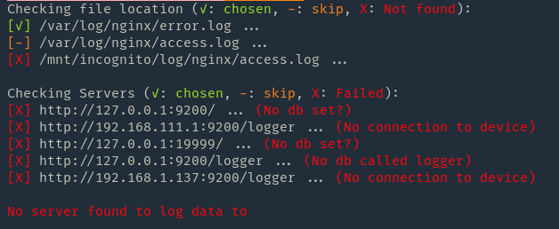

# elasticsearch-nginx-logger

An application to actively monitor access.log and bulk them to elasticsearch



### Basic usage
```bash
$ rust-logger [access.log file(s)] [database(s)] 
```
**Example**
```bash
$ rust-logger /var/log/nging/access.log http://127.0.0.1:9200/logger
```
It doesn't matter what order the arguments are provided. Just if it's a path, and a HTTP server address.

If none are provided, rust-logger will try some default paths and servers. These are:

`http://127.0.0.1:9200/logger` and `/var/log/nginx/access.log`

### Supported arguments:

---
`-b` | `--bulk` [number] :

Amount of requests before performing bulk request. The higher this number is, the more will be held in ram at once.

The less this number is, the more individual requests are done towards the DB.

Default is 2000

---

`-c` | `--count` [number] :
  
How many days before it moves documents to physical disk. Useful in case there are millions of requests within days.
Set `-c 0` to never move to disk, default is 30 days.

When saving to disk, it will only keep a log of unique requests within that day.

---

`--zip` :

If you want to save to disk as a compressed zip, default is `true`

`--raw` :

Saves to disk in raw text, default is `false`

---

`-d` | `--delete` [number] :

Days for when to completely delete the log. If this is shorter than `-c`, it won't save to disk at all, but just delete from DB.

---

`-y` | `--yes` :

Continue without asking for confirmation. You would need to provide this if you're planning to run this application with systemd for example.

---

### Elasticsearch mapping

*I'm hoping to change this to a more dynamic approach in the future. Like with a config file or something, read the [notes](#notes) for more info*

The default mapping for elasticsearch is this:

```json
{
  "mappings": {
    "dynamic": "false",
    "properties": {
      "ip": {
        "type": "ip"
      },
      "alt-ip": {
        "type": "ip"
      },
      "request": {
        "type": "text",
        "fields": {
          "keyword": {
            "type": "keyword",
            "ignore_above": 256
          }
        }
      },
      "refer": {
        "type": "text",
        "fields": {
          "keyword": {
            "type": "keyword",
            "ignore_above": 256
          }
        }
      },
      "status-code": {
        "type": "short"
      },
      "size": {
        "type": "integer"
      },
      "user-agent": {
        "type": "text",
        "fields": {
          "keyword": {
            "type": "keyword",
            "ignore_above": 256
          }
        }
      },
      "time": {
        "type": "date",
        "format": "epoch_second"
      }
    }
  }
}
```

## NOTES

As of right now, there is no support for custom nginx logs. It only supports the default layout.
It would be desirable to be able to provide the mapping, and matching in some kind of config file.

Not skilled enough in rust to do this.